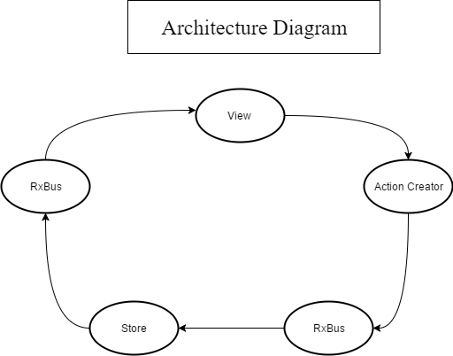

Fluxion
============


Library to simplfy integrating RxJava with the Flux Architecture in Android.
This architecture system is designed to allow for linear data flow, immutability, control of traffic flow etc.

 * Eliminate creating custom Events or Actions for Eventbus.
 * Worry about creating Action methods and not observables and posting to the event bus extend ActionCreators with FluxionActionCreator and postAction().
 * No more eventbus subscribe methods throughout the application implement FluxionViewInterface in Activities and BaseFluxionViewInterface in Fragments, and Adapters.
 * Post store change.

```java
class ExampleActivity extends Activity implement FluxionViewInterface{

  @Override public void onCreate(Bundle savedInstanceState) {
    super.onCreate(savedInstanceState);
    setContentView(R.layout.simple_activity);
    ButterKnife.bind(this);
    // TODO Use fields...
  }

  void onRegisterStores(){
    store.register();
  }
  void onStoreChanged(StoreChange change){
    switch(change.getStoreId){
      case Constants.STORE_ID:
        switch(change.getFluxionAction.getType()){
          case Actions.SOME_ACTION:
            //Open Fragment or update view
        }
        break;
    }
  }

  void onStoreChangedError(StoreChangeError error){
    if(error.getThrowable() instanceOf SomeCustomException){
      //Do something with views
    }
  }
}
```

Download
--------
Add it in your root build.gradle at the end of repositories:
```gradle
	allprojects {
		repositories {
			...
			maven { url 'https://jitpack.io' }
		}
	}
```
Add the dependency:
```gradle
dependencies {
	        compile 'com.github.nigelbro:fluxion:v1.0'
	}
```

More examples
-----------

Creating ActionCreators

Actions Creators are Synchronous which means you should not be doing any work. It is here to simply pass actions to the subscription manager to emit to onRxAction in the Stores.


1. Create New Class ActionsCreator
2. Create Corresponding Actions interface
3. Extend RxActionCreator
4. implement Actions interface
5. Override methods in Actions interface
6. call FluxionActionCreator  postAction(String actionId, Object... data) in Actions Interface method definition.
7. done


```java

class ActionCreator extends FluxionActionCreator implements Actions{

    public ActionCreator(Dispatcher dispatcher,SubscriptionManager manager){
      super(dispatcher,manager);
    }

    @Override
    someMethodDeclarationinActionsInterface(){
      postAction(String actionId,Object... data);
    }

}

```
Stores are responsible for all business logic and application state. This is the only place you will do worked that needs to be either displayed by a View or store state that needs to be accessed by a View.

Creating Stores

1. Create New Class {Some}Store
2. Create Corresponding {Some}StoreInterface
3. Extend RxStore
4. implement {Some}StoreInterface
5. Override methods in store interface
6. Override onRxAction(RxAction action)
7. Use Switch Statement to Decide on action logic
8. postChange(new RxStoreChange(action,STORE_ID)) or postStoreChangeError(new CustomException())
9. Done

```java
//Emitting storeChange to Views once some work has been completed and or application state changed
//This postChange() method will cause the dispatcher to call all Views registered to listen to store changes and call their onStoreChanged inherited method
class AppStore extends RxStore implements AppStoreInterface{

    public AppStore(RxDispatcher dispatcher){
      super(dispatcher);
    }

    @Override
    public void onFluxionAction(RxAction action){
      switch(action.getType){
        case {ActionInterface}.{ACTION}
          //do something
          postChange(new StoreChange(Constants.STORE_ID, action))
          break;
      }
    }
}

//Emitting storeChangeError Views to once some work has failed and or application state could not be changed
//This postChangeError() method will cause the dispatcher to call all Views registered to listen to store changes and call their onStoreChangedError inherited method
class AppStore extends FluxionStore implements AppStoreInterface{

    public AppStore(Dispatcher dispatcher){
      super(dispatcher);
    }

    @Override
    public void onRxAction(FluxionAction action){
      switch(action.getType){
        case {ActionInterface}.{ACTION}
          //something failed to happen
          postChangeError(new CustomException(Some Data));
          break;
      }
    }
}

```

An ApiStore Example

*Create ApiStore to handle all networking*
*This is an example using Ion*

```java
public class ApiStore extends FluxionStore implements ApiStoreInterface {

	@Inject Ion mIon;
	private Context mContext;
  private List<Person> mUsers;

	@Inject
	public ApiStore(Dispatcher dispatcher, App app) {
		super(dispatcher);
		app.getComponent().inject(this);
		this.mContext = app;
	}

	@Override
	public void onFluxionAction(FluxionAction action) {
		switch(action.getType()) {
			case ApiActions.MAKE_SOME_NETWORK_REQUEST:
				if(!internetAvailable){
						postChangeError(new StoreChangeError(new NoInternetConnectionError(NO_INTERNET_MESSAGE)));
				}else {
					Observable.just(getUsers(action))
					          .subscribeOn(Schedulers.io())
					          .observeOn(AndroidSchedulers.mainThread())
					          .subscribe(result -> {
						          if(result == null || !result.isSuccess()){
							          postChangeError(new StoreChangeError( NetworkRequestException("Message")));
						          }else if(result.isSuccess()) {
							          mUsers = result; //Store state of request so list of users this is good if you make multiple requests and you can give add this as a time, value pair and if this state has been updated in say the last 5 mins use it instead of sending another action to the action creator to make this network call.
							          postChange(new StoreChange(Constants.API_STORE_ID, action));
						          }
					});
				}
				break;
	}

/**
This method would be placed inside on the ApiStoreInterface.java
**/
  @Override
  public Person getUsers(){
    return mUsers;
  }

/**
This is clean and simplified way to use Ion as an Object and make Synchronous calls and parse objects as responses
**/
	private List<Person> getUsersRequest(final RxAction action) {
		List<Person> users = new ArrayList();
		try {
				users = mIon.build(mContext).load(POST,BuildConfig.BACKEND + GET_USERS_ENDPOINT).setBodyParameters(createPostParams(new ApiAuth(action.get(Keys.USER_API_CRED)))).as(new TypeToken<List<Person>>() {}).get();
		}catch(Exception ie){
			Crashlytics.logException(ie);
			ie.printStackTrace();
		}
		return users;
	}

/**
This is a helper method for building the mapping postParams for a Ion request
**/
	private Map<String, List<String>> createPostParams(ApiAuth credentials) {
		Map<String, List<String>> params = new HashMap<>();
    params.put(TOKEN, Arrays.asList(credentials.token));
		return params;
	}
  /**
  This is a helper method for building a JsonObject from an Object using JsonParser for a Ion request
  **/
	private JsonObject createJsonBody(Object object) {
		Gson gson = new Gson();
		PurchaseDataModel dataModel = (PurchaseDataModel)object;
		String obj = gson.toJson(dataModel);
		return (new JsonParser()).parse(obj).getAsJsonObject();
	}
}

```
License
-------

    Copyright 2017 Nigel Brown

    Licensed under the Apache License, Version 2.0 (the "License");
    you may not use this file except in compliance with the License.
    You may obtain a copy of the License at

       http://www.apache.org/licenses/LICENSE-2.0

    Unless required by applicable law or agreed to in writing, software
    distributed under the License is distributed on an "AS IS" BASIS,
    WITHOUT WARRANTIES OR CONDITIONS OF ANY KIND, either express or implied.
    See the License for the specific language governing permissions and
    limitations under the License.


 [1]: http://square.github.com/dagger/
 [2]: https://github.com/koush/ion
